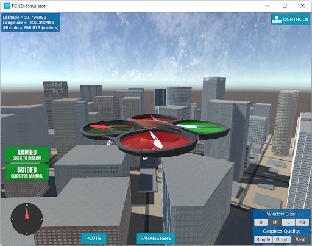
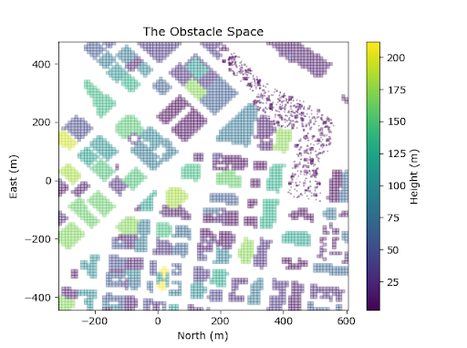
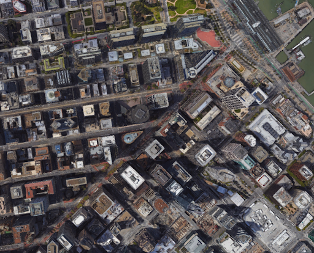
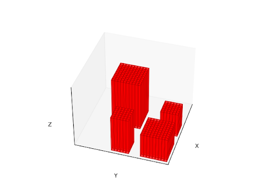

# The Preface 
My name is Ronen Aniti, and I am a college graduate with a Bachelor’s degree in mechanical engineering from The University of Texas at Austin’s Cockrell School of Engineering. I graduated from that degree program in December of 2016. After graduating, I became a professional private tutor, founding a business called Ronen Redefines Tutoring, through which I have not only helped over 200 students prepare for standardized tests and college entrance but also deepened my interest in logical reasoning and mathematics. For the past two years, I have been considering transitioning careers to become an engineer or a scientist. I want to put my skills on display, so I am taking it upon myself to prove them with a project. That’s what this report will be about. 

# The Background
I am writing this report as I complete the first milestone of the project. The project involves developing a path planning program in Python to aid a virtual quadcopter in navigating a simulated model environment of a San Francisco city block. I found this project on a website called Udacity, the educational platform that offers Nanodegree credentials for a variety of interesting topics, from data science to autonomous vehicles. It’s the latter subject that piqued my interest when I first visited the site, in search of a project to work on. Three things stood out to me about the Flying Car and Autonomous Flight Nanodegree: the math was involved, there would be projects, and I was eligible for a discount. It wasn’t just those things, though. The program offered an opportunity to learn a new skill set and to introduce myself to a new topic. The Nanodegree seemed like it would be a challenge that–if I were to follow through with completing–could prove rewarding. That’s exactly what I was looking for.

There are three components to the nanodegree: there’s lecture material that provides high-level coverage of concepts, there’re the programming exercises following each module, which provide an opportunity to implement the concept being taught, and there’re projects that follow each of the main sections of the course. I am writing this report as I complete the project that follows the first main section, which is on a topic called path planning. Ahead lies a project involving developing a control system for an simulated autonomous quadcopter, a project involving developing a state estimation algorithm for a simulated autonomous quadcopter, and a project involving developing a control system for a simulated autonomous fixed-wing aircraft. If you don’t know what those things are, don’t worry. Actually, I hardly do. This project, that I am sharing with you here, is the beginning of my journey in discovering what they are about.

The topic of path planning, which itself is a subtopic of the more general notion of motion planning, is the idea of developing algorithms to enable an autonomous vehicle to find its way around its own physical environment in a safe manner–so without colliding with obstacles like trees, people, or buildings. In the case of this project, the autonomous vehicle is a computer model of a quadcopter drone that exists inside of a simulation program called the Flying Car Nanodegree Simulator, developed by Udacity. For now, the simulator will handle what are called the “low-level” controls for the quadcopter, namely controlling the rotation rates of each motor. What I will be focusing on is developing code in Python that will, provided with some start location within the city block and some goal location within the city block, produce a sequence of waypoints, a path, for the drone to follow in order to reach the destination safely. 

# The Problem
The problem of writing a program that is capable of producing flyable paths for the simulated quadcopter to follow through the 3D virtual environment of the San Francisco city block is the problem that Udacity is requesting that I solve. Udacity is providing starter code that establishes a connection with the drone simulator and establishes a framework that can be extended to enable the drone to listen to and respond to events that occur inside of the simulation environment, such as the drone receiving new measurement readings from its onboard sensors or the drone nearing within a certain threshold distance of a target waypoint. Udacity is also providing a data file that contains the positions and dimensions of the obstacles of the virtual city block, with obstacles being discretized in such a way that each is represented as the union of one or more 3D boxes with, for the most part, a length and width of 10 meters and a height that varies from three meters for the shortest tree located on the city block’s northeast foliage to 212 meters for the block’s tallest building.

  
**Figure 1.** The Flying Car Nanodegree Simulator is a tool that simulates numerically and visualizes the flight of an autonomous quadcopter drone as its control system receives the waypoint commands produced by the computer program I develop in this project.

  
**Figure 2.** The path planning algorithm I develop in this project must be capable of providing the autonomous agent inside of the simulator with waypoint commands that navigate the drone safely through the urban environment without causing the drone to collide with obstacles, like buildings or trees.

For context, the course’s lesson material introduced several path planning algorithms. There were the sampling-based routines, namely, the probabilistic roadmap and the rapidly-exploring random tree, which return a waypoint sequence by traversing a randomly sampled subset of position-orientation combinations or ”states” from the set of all such states available for the drone to fly to inside of the 3D environment. There were the geometry-heavy techniques, like the Voronoi and medial axis methods, which involved discretizing the environment into spatial regions whose boundaries represent safe-to-fly routes and searching that discretization with another computer algorithm to find a waypoint sequence from a start position to a goal position that is both as short as possible and maintains distance from obstacles. Finally, there was the potential field technique, a more math-intensive technique that involves directing the drone’s motion according to the output of a vector-valued function that models the interaction between attractive forces that pull the drone towards goal locations and repulsive forces that push the drone away from obstacles. 

I had work cut out for me. It would be up to me to get comfortable enough with these techniques in order to make an informed decision about which ones I would want to include in my solution code. It would be up to me to ensure that the solution I submit to Udacity is efficient enough such that it’s able to produce planning commands within the fractions of a second that are between the drone’s sensor updates. And finally, it would be up to me to ensure that I make something of this project. This project is something that I’m doing by choice, independently. In fact, I took on a second job near my home that is part-time just to complement the income I’m earning tutoring so that I’d be earning enough money to fund this nanodegree and work towards completing the credential without feeling rushed. It’s important to me that I create something that I’m proud of by the end. 

Two principles that I’ve come to value as a result of being a tutor guide my work: 1. It’s important to develop an understanding of foundational concepts when entering a new line of study and 2. It’s important to challenge one’s skills on a regular basis.

My aim in the following several sections is to describe the steps I took and the logic I considered in building a path planning module to extend Udacity’s flight computer base code. As a result of my work, the simulation quadcopter drone is able to compute a waypoint path that is reasonable in terms of being as close to as short as possible and in terms of maintaining a safe distance from obstacles and is able to fly autonomously and safely from its spawn point to any point in free space. The approach I took to working on developing my solution was structured and methodical and led me to advance my understanding of concepts and skills I was, prior to starting, curious about but inexperienced with, namely, computer programming constructs, like object-oriented programming, data structures and algorithms, and autonomous systems concepts. For instance, I would explore each pathfinding technique covered by the Udacity motion planning course until I felt like I understood it conceptually, was comfortable implementing it in code, and was able to produce code that was on par, both in terms of performance and in terms of readability and organization, with the comparison code Udacity provided to students at the end of each of the course’s learning modules. This was a time consuming, at times frustrating, process, but it was ultimately an educational process that gave me a reason to make use of my familiarity with basic math concepts and ability to think through problems in a step-by-step way.

At the highest level, my aim with these next several sections is to describe what this process of building and learning was like for me, answering the questions “What did I do, and what were the results?”, not only from the standpoint of what results was the computer program I built able to achieve but also from the standpoint of how solving this problem in a systematic way led to my becoming better prepared for my career transition. I intend to detail the process thoroughly enough so that any potential future colleagues or hiring managers reading this report would be able to gain an accurate understanding of what, at this point in time, my professional abilities and the limitations to my skills are. I will begin my report by describing my exploration of the map data that Udacity provided me. After that, I will detail how my path planning solution emerged from my methodical study of and experimentation with a variety of distinct pathfinding techniques well-established in the field of autonomous systems.

Properly solving a multifaceted or complex problem requires a comprehensive understanding of the problem’s component parts. For me, developing that comprehensive understanding began with an examination of the satellite image that, as part of its request for a technical solution, Udacity had provided to indicate the drone’s mission environment, centered at the geodetic position 37.792480o N and -122.397450o W, located at the corner of San Francisco’s Market Street and Pine Street, beside the San Francisco Bay. What I observed was an urban layout, a city section, with many buildings and roadways and with some trees along some of the roads and inside of what appear to be nature parks and outdoor recreational areas. These structures, collectively, both man-made and human-planted, would be the drone’s obstacles. The space between buildings, the space above roadways, and, in the northeast corner of the city section, the space above the San Francisco Bay, would provide the drone with space to maneuver. 

  
**Figure 3.** The satellite image provided by Udacity of the drone’s planned mission environment indicates that the mission environment is a city section densely packed with buildings and some nature and whose roadways render the environment inherently grid-like or array-like in topology.  

After recording my observations of the satellite imagery of the drone’s mission environment, I proceeded to examine the second piece of information that Udacity provided with its request for a path planning solution: a comma-delimited data file that completely describes the geometry of obstacles I am to consider. I found that all whole objects of the drone’s mission environment, like entire buildings or entire trees, are represented by the joining together of one or more component volumes, all three-dimensional rectangular boxes, not necessarily uniform in height, having, for the most part, identical square height-axis cross sections. I found that the position and size of each of these box-shaped partitions is defined according to its center position and half-widths in three-dimensional space and that the bottom face of each box sits flush with the mission environment’s zero altitude mark. Furthermore, I observed that obstacle-volume ground positions are specified using the Universal Transverse Mercator (UTM) coordinate system, a projection of an ellipsoid model of Earth’s shape onto a flat, two-dimensional surface, and that altitude is specified in meters above Earth’s ground level.

  
**Figure 4.** With Python’s plotting and visualization library Matplotlib, I created this depiction to demonstrate the obstacle data’s underlying discretization structure, characterized by whole-object obstacles, namely buildings and trees, represented by the joining together of one or more component subvolume boxes in R3.

Having finished my initial observations on the drone’s mission environment’s geospatial layout and obstacle discretization structure, I began working to frame the quadcopter path planning problem with more specificity than was initially included with Udacity’s open-ended statement of the problem, which was extending the simulation flight computer code successfully enough such that the drone is able to plan collision-free paths from a fixed spawn location to any goal location inside of the 3D mission environment. My idea was that, in order to frame the problem statement with greater specificity, I should take care to define, in a mathematically precise and rigorous way, the constructs I anticipate being essential to solving the path planning problem. 

That process of establishing definitions began with my formulation of what comprised the drone’s mission environment. Since the path planning module I was to develop was required to ultimately produce an XYZ waypoint sequence, I decided to define the mission environment E as the set of all points in three-dimensional Euclidean space bounded by, in each coordinate direction, the maximum and minimum positions of all obstacles provided with the Udacity obstacle mapping data file.

My next idea was to provide a way to categorize all of the locations in the mission environment representation, E, as being either obstacle or non-obstacle since the drone’s mission will fail if the drone collides with any position in the environment that is occupied by an obstacle. Due to the fact that the obstacle data provided by Udacity were structured such that obstacles are discretized as 3D boxes, each defined by one XYZ center position and one half-width along each of the three coordinate directions, I made the initial decision to describe each obstacle partition as comprising all of the points it bounds.

However, a further consideration led me to make a slight adjustment to this representation. Under the rule of what was my current representation of obstacle subvolumes, there was the certitude that some locations belonging to E but not carrying the label as being within the boundaries of any obstacle partition would still, if occupied by the flying robot, be sites for collision, the reason being that the autonomous quadrotor itself is, in actuality, not a point object but rather an object with a finite and nonzero size–a nonzero height, a nonzero width, and a nonzero length. Also, the reason I was, in the first place, taking care to mathematically and explicitly define a representation for obstacle partitions was my presumption that a path planning program that works properly must have a way of accessing a model of locations that would cause a collision to occur in the circumstance of being occupied by the autonomous quadcopter. So, as reconciliation, what I decided to do was expand the representation for each obstacle partition by some safety margin, s, applied uniformly in each of the three coordinate directions. 

The result of this approach was that the obstacle subvolume representations included not only points in space that are bounded by obstacles but also included points in space that are not bounded by obstacles but should still be classified as no-fly zones, given the requirement for only collision-free paths to be output from the path planning module. 

And, at that point, I had framed the problem in such a way that I could refer collectively, using the notation Os, to all locations bounded by either an obstacle subvolume or the margin of safety around an obstacle subvolume.

Furthermore, from this description of no-fly locations, I derived a way of expressing the set of all safe-to-fly locations, free space, F, establishing that F is the set of all locations included in E but not included in Os. 

What this careful setting up of definitions allowed me to do was refine the problem statement’s general notion of determining collision-free paths to the more specific notion of determining sequences of locations in three-dimensional space leading from some start position, S, belonging to free space, F, to some goal position, G, also belonging to free space, F, where every intermediate point in the sequence connecting S to G also belongs to F, and thus does not belong to Os, the set of all obstacle-bounded points and all points deemed unsafe due to being in close proximity to the boundaries of obstacles.

Defining the problem in this way was an important step in adding rigor to my approach to solving the path planning problem. That being said, there was still more I felt I should clarify before proceeding to try generating solutions. In particular, these questions remained with me unanswered: Should any path of points from the start position to the goal position that also shows no overlap with obstacle boundaries or safety margins suffice as good output of the planner that I build, or should my path planning solution consider some of these paths as being better than others? Admittedly, the answer seemed obvious: that is, some paths should be considered as better than others because some paths are safer or shorter or somehow more efficient than other paths. However, actually defining, for instance, what makes one path between a given start position and a given goal position better or worse than another path connecting those same two beginning and end positions required reflecting on what I would want to assert to be my performance metrics.
	
The Udacity course on aerial robotics motion planning suggests that there exist four fundamental principles that would be wise for me to consider in developing path planning algorithms in such a way that considers the distinctive and important points characterizing the problem I was working on–path planning in a densely-packed urban environment–so, what follows is a description of what those principles are and a description of how I transformed those principles into measurable assessment criteria.

The first of the four fundamental principles involves safety: all else held equal, paths resulting in the autonomous drone flying further from obstacles are safer and thus more preferable compared to paths that result in the drone flying closer to obstacles. Leveraging the fact that obstacles in the problem I was solving are represented using a discretization pattern known in advance and position and geometry known in advance and that, as per Udacity’s specification of the problem, no other obstacles were to be considered in solving this problem or otherwise added to the map during the course of the drone’s mission, I implemented the stated safety principle as a quantifiable performance metric by incorporating mathematical logic built on the notion of averaging and finding nearest-neighbor obstacles, mathematical logic I develop with the following set of statements.

A path, P, is, when returned from a path planning algorithm I am to implement, structured as an ordered list of N points belonging to free space, F, so, as such, each element of the path is an ordered triplet representing a spatial position in R3 not enclosed within the bounding box of any obstacle partition nor enclosed within the region of safety margin around an obstacle subvolume.

Each obstacle subvolume can be characterized by its ground position coordinates and the vertical distance between ground level and the subvolume’s top face, where that distance is also adjusted by the safety margin distance. I can organize these three measurements, horizontal position in space, vertical position in space, and height, as a three-tuple and then organize each of those three-tuples into a set I create to aid in computation, a set which I refer to as Oxy.

With a set defined to keep obstacle ground position and height information organized, I can, also, from that original set, create a derived set that contains only the ground position and height information of obstacles that have adjusted heights above any arbitrary altitude of interest, zcurrent. I leverage this idea in what I state next.
	
	

For all points along path P, there exists an obstacle partition from the derived set O’xy that is positioned closer, in terms of ground distance, to that path point than to any other obstacle partition’s center. When I refer to the derived set O’xy. What I mean by ground distance is the length of the displacement vector that originates from a given path point to the position of the nearest obstacle’s center point, but having that vector being projected onto the XY plane. Also, the derived set O’xy is recomputed for each point using zcurrent = zi, where zi represents the altitude of the ith point of the waypoint sequence.

The distance between each point of P and each point’s nearest obstacle center position is averaged. The resulting metric, which I denote D, serves as a reasonable measure of a given path’s overall conformance to the principle that paths that maintain more distance from obstacles are, on balance, safer than paths that maintain less distance from obstacles, the reason being that the mathematical notion of averaging is a way of stating the central tendency of a measurement that is taken multiple times.

	

The second principle suggested by the Udacity coursework on aerial robotics motion planning involves the merit of shortest-distance paths. The way I state the principle is as follows: When two paths, both having start locations that are identical to one another and goal locations that are identical to one another, and both also being identical in all other respects except for the respect that the total distance of each path differs by some amount, the path having the shorter distance is more desirable. Also mentioned in the coursework on path planning for flying robots is the guarantee that, for any start-goal pairing between which a path exists, a shortest-distance path will also both exist and will be able to be found using certain pathfinding algorithms well-established in the field of computer science that operate on mathematical representations called graph structures, comprising nodes and edges connecting nodes, where the nodes, in the case of quadcopter path planning, are representing locations from the drone’s physical environment and the edges are representing valid modes of navigation from one location to another. What I do to develop a measurable performance criterion to indicate how well a given path conforms to the shortest-distance principle emphasized in the Udacity coursework is develop a mathematical expression that directly compares this shortest-possible path length (Lo) to the actual measure of path length (L)–where path length itself is the summed Euclidean distance of each pair of consecutive points. The closer this ratio is to zero, the better, since the quantity L – Lo represents how much longer a given path is compared to what is shortest-possible.

The third principle indicated in the Udacity autonomous quadcopter coursework involves the notion of computational speed. The way I would articulate the suggested principle is as follows: When two path planning algorithms are identical in all respects, including the respect that the algorithms produce identical output navigation routes given identical input mapping data but except for the respect that the two algorithms’ typical execution times are different, the algorithm that tends to produce its outputs faster should be considered the better algorithm. Naturally, then, execution time, which I will denote T, is a sensible performance metric. Leveraging programming strategies suggested in the coursework, including considering the computational complexity implications of code I write, implications pertaining to how the demands for processing time and memory space scale as the input variables to my algorithms grow, and considering utilizing Python’s NumPy mathematical computation library to streamline numerical computations through a process called vectorization–making these considerations would help me accomplish the end of minimizing the execution time of my algorithms in such a way that does not compromise performance across any other performance domain I have deemed important.

The fourth principle suggested by the Udacity flying car course pertains to the merit of paths being sparse. The concept of the sparsity of paths concerns how close or how far apart are consecutive waypoints, though the notion is more nuanced than that. To elaborate, for a path to be sparse, it must conform to the following set of rules.

The start position, S, and the goal position, G, both belonging to free space, F, must be indicated as the first waypoint and the final waypoint of the waypoint sequence, respectively.

Besides the cases of the starting waypoint, S, and the destination waypoint, G, waypoints may only be added to the path if they represent locations in free space, F, where the direction of the flight path changes.

Consecutive waypoints must be in direct line of sight of one another. Line segments drawn connecting consecutive waypoints must not intersect any obstacle volume belonging to the set of all obstacle volumes, Os.

I devised these rules after considering how the Udacity simulation drone’s lower-level motion planning codes will be processing the waypoint commands provided by the path planning codes I will be developing. When the downstream codes receive the instruction to travel to a certain position, they consider the drone’s current position, the drone’s target position, and a target current-position-to-next-waypoint travel time, all to compute a trajectory–i.e., a mathematical rule prescribing the quadcopter’s X, Y, and Z motion as a function of time–between the two positions that is as smooth as possible. However, the particular trajectory creation codes employed onboard the Udacity drone assume the drone’s intention is a full stop at the commanded position. This is far from ideal. For one, this method will cause the drone to tend to take longer to complete missions, and while elapsed mission time is not a strict performance metric being established with this project, it is still a practical consideration. Also, trajectories created in this manner will tend to demand more effort from the motors of the autonomous quadcopter being simulated than they would demand otherwise–a consequence that also doesn’t affect any strict performance metric established herein but is still a reasonable consideration. 

The way I decide to transform the notion of path sparsity into a measurable performance criterion is with a simple ratio comparing how many waypoints from a given path are neither direction change points nor starting or ending positions–comparing that counted quantity, which I denote Nf, to the counted quantity of how many waypoints there are in the path altogether, which I denote N.

Finally, after I spent time formulating and conceptualizing, breaking down what was an open-ended request into what I’d consider being a somewhat more systematic framework accordant with my aim, that being preparing this project for the processes of engineering design and scientific inquiry, it was my time to face the fact that constructing the system that will become my solution necessitates knowledge not only about what path planning is, but it necessitates also knowing what is the Udacity flight computer, the complementary piece to the path planning system in question. Warranting examination now is the latter of these two elements of awareness. Diagramming the high-level workings of provided code is the way I carry out the examination of the Udacity flight computer logic. And what I discovered from my efforts in diagramming the high-level workings of the Udacity flight computer logic–paired with complementary research I was also able to conduct while engaging in this diagramming process–is that the flight computer works according to a principle from theoretical computer science referred to as finite state machines.

And according to my understanding of that research I had conducted, the principle of finite state machines is a framework for abstracting or conceptualizing the behavior of a real-life machine, physical, cyber-physical, or otherwise, for instance a quadrotor drone that is programmed to fly itself. The premises of the principle of finite state machines are that machines described according to this model are characterized by distinct modes of behavior or “states”, which are completely laid out in advance by the creators of the machine, and also that machines described according to the finite state machine model are able to exhibit the behavior of one and only one of these functional modes at any one given moment in time. Fundamental to the concept of finite state machines, moreover, is the notion that such machines switch over from manifesting the behavior of one predescribed operational mode to manifesting the behavior of another predescribed operational mode only when certain sets of conditions, also defined in advance by the machine’s creators, are met.

What did my examination of Udacity’s flight computer code reveal about how the Udacity simulation quadcopter drone conforms to the principle of a finite state machine? My inspection revealed that the code’s logic is organized as a collection of cause and effect relationships. 

Getting the autonomous quadcopter simulation drone up and running inside of the Udacity Flying Car Nanodegree Simulator is achieved when the user opens the Udacity Flying Car Nanodegree Simulator and runs a series of commands on their own computer. What these commands do is establish a special type of communication link, called Mavlink (Micro Air Vehicle Link), with the simulation drone inside of the Udacity Flying Car Simulator. With the Mavlink connection established, the drone prepares itself for autonomous flight. This preparation begins with the drone entering the first of its four modes of autonomous operation: planning. In the planning state, the flight computer executes path planning logic to generate a route from its current position to any non-obstacle goal position on the San Francisco city block map, that map being provided in advance by Udacity and that goal position being specified by the human overseeing the mission as a whole. 

When the path planning logic is finished determining the navigational route, the drone enters what could be considered flight takeoff mode for autonomous flight. The drone’s manifest behavior in this mode is simply ascending from its starting position within the 3D San Francisco city block simulation environment until reaching a height within the simulation environment matching the exact altitude of the first specified XYZ position of the waypoint sequence of the autonomous simulation drone’s navigational plan. The drone’s onboard sensors help other algorithms onboard the drone’s computer system in making frequent best guesses as to where the drone is located within the simulated urban landscape and also how the autonomous quadrotor is oriented in the angular sense, that is the drone’s angular rotation about each of the three principal axes, X, Y, and Z. So when the event occurs that the drone has reached the ascent altitude, the effect is that the drone enters the next state, that being of the waypoint following or route following behavior mode–arguably the most interesting of all four of the major modes of the simulated autonomous quadcopter’s finite state machine behavior profile. 

The reason I consider the autonomous quadcopter’s waypoint tracking behavior mode to be the most interesting of its four main autonomous flight modes of operation is because–well frankly, it’s because the aerial robot’s performance in this mode of operation will largely depend on how good or how poor is the quality of the algorithm responsible for generating the waypoint sequence for the drone’s mission, that algorithm’s development being my primary responsibility, my primary project, the undertaking I am expounding on here in this very construction of this very report.

Once the Udacity drone is in waypoint following mode, it follows a sequence of steps to go from its current position to the target position. It begins to fly to the next waypoint. As it comes within proximity of the ahead waypoint, its onboard computers begin driving it towards the next ahead waypoint. This pattern continues until the drone has reached proximity to the goal position. When the drone reaches proximity of the goal position, the drone enters another state, which I’ll call the landing state, which is simple, in that the drone simply enters a landing sequence, a process that only involves a descent to ground altitude, shutting off of the motors, and exiting autonomous flight.  

As I inspected the Udacity flight computer code, though, a nuance came to my attention that shed light on the behavior of the drone. I know that the controller is always driving to the next waypoint only with the assumption that a full stop is required. However, I also see that Udacity engineers have programmed into a conditional statement into the logic of waypoint following mode. That logic triggers the drone to track the next ahead waypoint before the drone completely reaches the target position. The effect of this, I notice, is that the drone will never actually stop at the ahead waypoint. I reflect on this and realize that this is probably a good thing in my application since this behavior keeps the drone not losing any momentum. After all, this is a simplistic simulation. There are no payloads to drop or reconnaissance to be conducted at target waypoints. The mission is simply getting the drone from start position to goal position without colliding with obstacles.

**Figure 5.** I created a simplified diagram to illustrate what are the four main states of the Udacity drone as a finite state machine. Each state is a behavior mode. Arrows on the diagram represent what are called state transitions. State transitions are sets of conditions that, when met, transition the drone from taking on the behavior of one behavior mode to taking on the behavior of another behavior mode. 

I’ve done quite a bit up to this point. I’ve read the problem statement. I’ve reviewed the inputs, specifically the mapping information and the Udacity flight computer code. From that information, I’ve transformed the problem statement into a more specific problem statement. However, my formulation has been quite expansive. It would be better before I begin documenting how I solve the problem, to state it precisely and concisely. What I come up with is as follows: given X a map of static obstacles, where obstacles are essentially specified by their bounding box coordinates in R3, find Y path or a sequence of XYZ positions on the map, where Y the path is collision free and also conforms to the rules A shortest-distance or the distance is as short as possible, B sparse or no waypoint that are not direction change points, unless the waypoint is a start or goal position], C waypoints maintain distance from obstacles, and where the process that produces Y conforms to the rule of D the algorithms that produce the path I designed with computational efficiency in mind. The entire solution must be implemented in Python and must integrate seamlessly with the Udacity flight computer code. 
