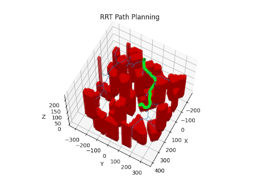

# Enhancing Autonomous Navigation with an Advanced RRT Algorithm

## Introduction

The realm of autonomous navigation presents significant challenges, particularly in efficiently and safely planning paths within complex environments. The project I embarked upon, developing an enhanced Rapidly-exploring Random Tree (RRT) algorithm with an innovative steering function, is a testament to the integration of mechanical engineering principles, mathematical rigor, and innovative algorithm design. This endeavor not only showcases my ability to innovate within the field of autonomous navigation but also incorporates sophisticated collision detection logic to ensure path feasibility and safety.



**Figure 1.** A representative plot showcasing the results of the enhanced RRT algorithm with the 3D steering function, demonstrating the algorithm's efficiency in navigating complex environments and ensuring path feasibility and safety.

## Core Algorithm Components

### State Representation and Steering Mechanism

Central to our algorithm is a refined state representation, defined as $\mathbf{S} = [x, y, z, \theta_x, \theta_y, \theta_z]$, incorporating both position $(x, y, z)$ and orientation $(\theta_x, \theta_y, \theta_z)$ components. This comprehensive representation is crucial for three-dimensional navigation, enabling rotational movement about multiple axes. The steering mechanism, inspired by Rodrigues' rotation formula, adeptly recalculates orientations to ensure smooth and precise directional control.

Rodrigues' rotation formula is articulated as:
$$
\mathbf{R} = \mathbf{I} + \sin(\phi)\mathbf{K} + (1 - \cos(\phi))\mathbf{K^2}
$$
where $\mathbf{R}$ signifies the rotation matrix, $\mathbf{I}$ the identity matrix, $\phi$ the rotation angle, and $\mathbf{K}$ the skew-symmetric matrix derived from the axis of rotation.

The skew-symmetric matrix $\mathbf{K}$, essential for defining the rotation axis, is given by:
$$
\mathbf{K} = \begin{bmatrix}
0 & -\theta_z & \theta_y \\
\theta_z & 0 & -\theta_x \\
-\theta_y & \theta_x & 0
\end{bmatrix}
$$

### Forward Integration Process

The forward integration step, vital for state transitions, meticulously applies velocity $(v)$ and time step $(\Delta t)$ to the newly determined orientation. This process, emphasizing the algorithm's nuanced advancement towards the goal, illustrates strict adherence to motion parameters and dynamic constraints.

## Collision Detection Logic

The algorithm employs a multifaceted approach to collision detection, ensuring paths remain clear of obstacles and within environmental bounds. This robustness is achieved through:

### Optimized Collision Checks

The `collision_check_vectorized` function underscores the algorithm's efficiency by utilizing numpy's capabilities for rapid potential collision assessments, balancing performance with accuracy.

### Spatial and Environmental Constraints

Functions like `inside_environment` confirm path viability within specified spatial parameters, highlighting the algorithm's real-world applicability.

### Comprehensive Path Segment Evaluation

The `collision_check_two_points` function exemplifies the algorithm's meticulousness in assessing path segment viability, ensuring each step towards the goal is safe and feasible.

## Pseudocode of the RRT Algorithm with Mathematical Expressions

```plaintext
Algorithm Enhanced RRT
1: Initialize tree with start state S0 = [x0, y0, z0, θx0, θy0, θz0]
2: for i = 1 to MAX_ITERATIONS do
    2.1: Sample random point P with bias towards the goal, P = [xp, yp, zp]
    2.2: Find nearest state S_near in tree to P, S_near = [xn, yn, zn, θxn, θyn, θzn]
    2.3: Calculate new orientation θ_new using Rodrigues' rotation: θ_new = R(θ_near, P - S_near)
    2.4: Integrate forward to S_new applying v and Δt: S_new = S_near + vΔtθ_new
    2.5: If S_new is valid (non-colliding and within bounds), add S_new to the tree
3: If goal is reached within tolerance, reconstruct path from S0 to goal
```

## Conclusion
This article has detailed the development of an advanced RRT algorithm, accentuating its mathematical underpinnings and algorithmic sophistication. The incorporation of Rodrigues' rotation formula within the steering mechanism, combined with a comprehensive state representation and robust collision detection logic, highlights the algorithm's capability
